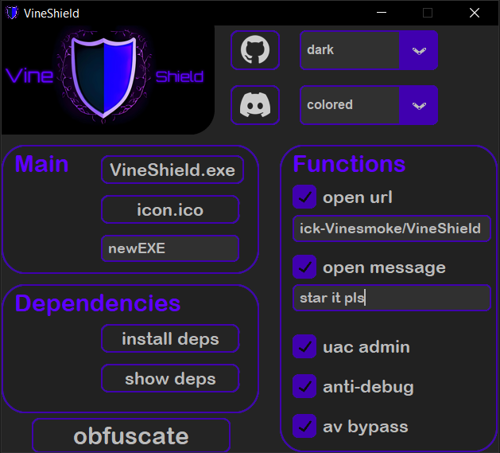

 🛡Obfuscation tool for all executing files and scripts written on python 3
 
 ⭐Please, star this repo if it was helpful⭐

 

 

 

 ---
 ### 🖼Overview

 

 

---
 ### ⚙Result after crypt

 [before crypting](https://www.virustotal.com/gui/file/06473d06f72afd1d8b5d6095dab333351162328d9af061ce20a967d330c43a24?nocache=1)

 [after crypting](https://www.virustotal.com/gui/file/75c91b29d5522c8a97c779e50bc33f11e07ed37b2baa31c8c727016e92915c1d)

---

 ### 🛠Building
So firstly you need to download [python](https://www.python.org/downloads/).
Install dependencies: `pip install -r /path/to/requirements.txt` and run `.py to .exe.bat`

---
### 💰 Donate

  BTC: <code>bc1qfe46xsewu00yhl0llzaxhz9re03y4al0w9p3v2</code>
  
  ETH: <code>0xeeA063838950D191881EdF0E31b4699B73aD20Ac</code>
  
  XMR: <code>48jeXS4GGpEJ2Kswn3zRXc3wBqK2s9ojJEohE47KW9ZMPdtnCGTTJGjc7iQpNWSrmmZCCLsj4WDNVa88Mb6kTeJhJWbtbmo</code>

  USDT(ethereum network): <code>0xeeA063838950D191881EdF0E31b4699B73aD20Ac</code>

  LTC: <code>LWyarn3cnVyVahgjDpr4uokCFQbq39KDuc</code>

---
### 📲Contacts

   

Our Discord server <a href="https://discord.gg/ufvyg5F2j4">join us</a>

---
[go up](#up)
